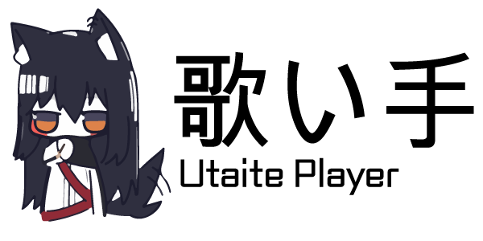
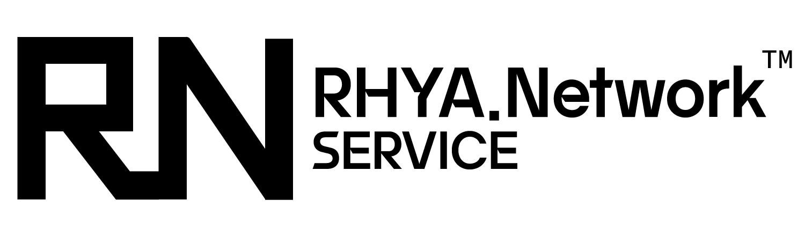

Utaite Player (우타이테 플레이어)
===

### 우타이테 플레이어란?  
우타이테는 일본의 서브컬쳐 계에서 종종 사용되는 인터넷 신조어로, 2000년대 후반부터 니코니코 동화 등에「노래해 보았다」는 제목으로 동영상을 투고하는 사람들을 가리키는 표현입니다. `Utaite Player (우타이테 플레이어)` 서비스는 이러한 우타이테들을 들을 수 있는 음원 스트리밍 서비스입니다.  

### 우타이테 플레이어 기본 정보

## 이용권 신청 방법
[RHYA.Network](https://rhya-network.kro.kr/) 홈페이지에 방문하여 로그인 및 회원가입을 진행한 후 우타이테 플레이어 항목에 `우타이테 플레이어 이용권 신청하러 가기` 링크를 클릭하여 이용권 등록 여부를 확인하고 만약에 이용권이 등록되어있지 않다면 `이용권 신청` 버튼을 통해 이용권을 신청하면 신청이 완료됩니다.

## 노래 신청 방법
[RHYA.Network](https://rhya-network.kro.kr/) 홈페이지에 방문하여 로그인 및 회원가입을 진행한 후 우타이테 플레이어 항목에 `우타이테 플레이어 노래 신청하러 가기` 링크를 클릭하여 `MP3 파일` 또는 `Youtube 링크` 를 통해서 노래를 신청하실 수 있습니다.

## RHYA.Network 계정
현재 `Utaite Player (우타이테 플레이어)` 서비스는 RHYA.Network Auth.v1 인증 방식을 사용하고 있습니다. 이 인증 방식은 RHYA.Network의 모든 서비스에 공통적으로 적용됩니다. (단, 일부 예외가 있을 수 있음) 우타이테 플레이어 서비스를 이용하시려면 `RHYA.Network` 계정이 필요합니다. 회원가입은 [RHYA.Network](https://rhya-network.kro.kr/) 에서 진행할 수 있습니다.  
  
RHYA.Network 계정의 부적절한 이용(예: 과도한 노래 신청, 서버의 부하를 가하는 행동 등)은 계정 정지 사유 및 IP 차단 사유가 될 수 있습니다. 이 점 유의 하시길 바랍니다.  
 
메일 인증 시 메일이 오지 않는 경우 메일이 `rhya.no.reply.mail@gmail.com` 주소로 발송되기 때문에 스팸 함에 보관되어있을 수 있습니다. 만약 스팸 함에 보관되어있지도 않고 여러 번 시도하였음에도 불구하고 메일이 발송되지 않을 때에는 다음 이메일 주소로 연락 주십시오. (관리자 이메일 주소: `sihun.choi@email.rhya-network.kro.kr`)

## Android 미리보기 이미지

* _저작권 문제로 모자이크 처리를 진행함_

## Windows 미리보기 이미지

* _저작권 문제로 모자이크 처리를 진행함_

## 시연 동영상
Youtube URL: https://youtu.be/05Ousk-c2Mk

## 업데이트 내역
[RHYA.Network](https://rhya-network.kro.kr/) 홈페이지에 방문하여 `공지사항`을 통해 볼 수 있습니다.

## Development and deployment environment
| Part                           | Environment                     | Remark(Version)                 |
| --------------------------     | ------------------------------- | ------------------------------- |
| Client (Windows)               | C# WPF                          | .Net Framework 4.6.2            |
| Client (Android)               | Java, Kotlin                    | Java 1.8.0, Kotlin 1.5.20       |
| WebServer & WAS                | JSP (Java), Apache Tomcat 7.0   | JavaSE 1.7.0, Apache Tomcat 7.0 |
| WAS (Internal connection only) | Flask                           | Python (3.6.0)                  |
| Database                       | Mariadb                         | Mariadb (10.3.32-1040)          |

## License
MIT License

Copyright (c) 2022 CHOI SI-HUN

Permission is hereby granted, free of charge, to any person obtaining a copy
of this software and associated documentation files (the "Software"), to deal
in the Software without restriction, including without limitation the rights
to use, copy, modify, merge, publish, distribute, sublicense, and/or sell
copies of the Software, and to permit persons to whom the Software is
furnished to do so, subject to the following conditions:

The above copyright notice and this permission notice shall be included in all
copies or substantial portions of the Software.

THE SOFTWARE IS PROVIDED "AS IS", WITHOUT WARRANTY OF ANY KIND, EXPRESS OR
IMPLIED, INCLUDING BUT NOT LIMITED TO THE WARRANTIES OF MERCHANTABILITY,
FITNESS FOR A PARTICULAR PURPOSE AND NONINFRINGEMENT. IN NO EVENT SHALL THE
AUTHORS OR COPYRIGHT HOLDERS BE LIABLE FOR ANY CLAIM, DAMAGES OR OTHER
LIABILITY, WHETHER IN AN ACTION OF CONTRACT, TORT OR OTHERWISE, ARISING FROM,
OUT OF OR IN CONNECTION WITH THE SOFTWARE OR THE USE OR OTHER DEALINGS IN THE
SOFTWARE.

## Other License
> 우타이테 플레이어 로고 아미콘 및 이미지  
> 이미지: https://twitter.com/Runamonet/status/1259002648184807424
>> _우타이테 플레이어의 로고로 사용된 이미지의 대한 모든 권리는 Runamonet에게 있습니다._  
>> _이용 허락: https://i.imgur.com/K1Qi87H.jpeg_  

 

> 우타이테 플레이어 로고 아미콘 및 이미지 Font (Y이드스트릿체)  
> Font : https://www.yspotlight.co.kr/brand/font
>> _Copyright © Y Brand., All rights reserved. (주)케이티_  

 

> Library Licenses
>> Licenses : https://rhya-network.kro.kr/RhyaNetwork/webpage/jsp/service/utaite_player_open_sources_licenses.jsp

  

